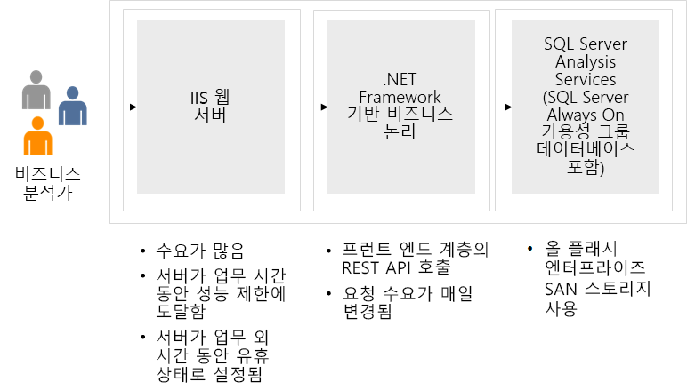

---
casestudy:
    title: '컴퓨팅 솔루션 디자인'
    module: '컴퓨팅 솔루션'
---

# 컴퓨팅 솔루션 디자인

소요 시간: 90분

## 요구 사항

Tailwind Traders는 제품 카탈로그 애플리케이션을 클라우드로 마이그레이션하려고 합니다. 이 애플리케이션의 기존 3계층 구성에서는 데이터 저장소로 SQL Server가 사용됩니다. IT 팀에서 여러분에게 애플리케이션 현대화 과정을 지원해 줄 것으로 요청했습니다. IT 팀이 제공한 다이어그램 및 개선 가능한 분야는 다음과 같습니다. 

* 프런트 엔드 애플리케이션은 .NET Core 기반 웹앱입니다. 사용량이 많을 때의 시간당 웹 사이트 방문 고객 수는 1,750명입니다. 

* 이 애플리케이션은 프런트 엔드 계층의 IIS 웹 서버에서 실행됩니다. 이 계층에서는 모든 고객의 제품 구매 요청을 처리합니다. 그런데 최근 세일 기간에 프런트 엔드 서버가 성능 한도에 도달하여 페이지 로드 시간이 매우 오래 걸렸습니다. IT 팀은 서버 추가도 고려했지만 사용량이 적은 기간에는 서버가 유휴 상태로 유지되는 경우가 많습니다.

* 중간 계층에서는 고객 요청을 처리하는 비즈니스 논리를 호스트합니다. 이러한 요청은 지원 센터에서 지원해야 하는 경우가 많습니다. 지원 요청은 큐에 추가되는데, 최근 지원 대기 시간이 매우 길어졌습니다. 그래서 고객에게 담당자가 연결될 때까지 대기하는 대신 이메일로 요청을 할 수도 있음을 안내하고 있습니다. 하지만 대다수 고객은 대기 시간이 너무 길다고 느껴 담당자가 연결될 때까지 기다리지 않고 전화를 끊습니다. 시간당 고객 요청 수는 75~125건입니다. 

* 백 엔드 계층에서는 SQL Server 데이터베이스를 사용하여 고객 주문을 저장합니다. 현재 백 엔드 데이터베이스 서버는 정상 작동하고 있습니다.

* 이 애플리케이션에서는 고가용성을 유지해야 하지만, 법적 요구 사항으로 인해 Tailwind Traders는 모든 리소스를 한 지역에 보관해야 합니다.

## 작업

* **프런트 엔드 계층**. 프런트 엔드 계층용으로 추천할 수 있는 Azure 컴퓨팅 서비스는 무엇인가요? 해당 솔루션을 추천하기로 결정한 이유를 설명하세요. 

* **중간 계층**. 중간 계층용으로 추천할 수 있는 Azure 컴퓨팅 서비스는 무엇인가요? 해당 솔루션을 추천하기로 결정한 이유를 설명하세요. 

안정적이며 효율적인 고품질 클라우드 아키텍처를 생성하려면 Well-Architected Framework 원칙을 어떻게 통합해야 하나요?
