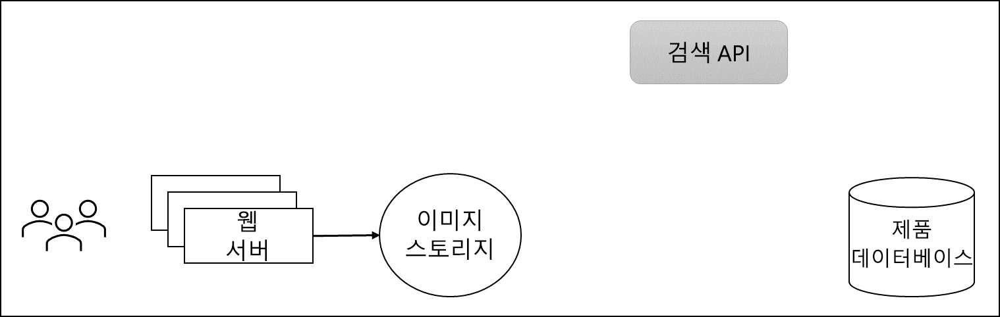

---
casestudy:
  title: 앱 아키텍처 솔루션 설계
  module: App architecture solutions
ms.openlocfilehash: 78b1c861678ff255c4080978cbd7d02d46d58aca
ms.sourcegitcommit: 0398c15157de2f621dd945e76523b824e500901c
ms.translationtype: HT
ms.contentlocale: ko-KR
ms.lasthandoff: 02/23/2022
ms.locfileid: "139134250"
---
# 앱 아키텍처 솔루션 설계

예상 시간: 90분

## 요구 사항

Tailwind Traders는 웹 사이트를 업데이트하여 마케팅에서 제공하는 기존 사진 외에도 고객이 제공한 제품 이미지를 포함하기를 기대합니다. 그들은 사용 중인 제품의 사진이 더 많을 경우 잠재 고객이 과거 고객이 제품 구매 후 얼마나 제품을 좋아했는지 더 잘 느낄 수 있다고 믿습니다. 아래에 설명된 대로 몇 가지 요구 사항이 있습니다.

* 업로드된 이미지는 웹 사이트에 게시되기 전에 스캔해야 합니다. 법률 및 마케팅은 모두 초기 업로드 후 회사에 제대로 반영되지 않거나 법적 문제를 일으킬 수 있는 문제에 대해 이미지를 검사할 것을 요청하고 있습니다. 필요한 스캔을 수행할 수 있는 사내 API가 이미 개발 및 배포되었습니다. 

* Tailwind Traders는 기존 패턴에 따라 하루 종일 이미지 업로드가 매우 고르지 않게 될 것으로 예상합니다. 특정 기간에는 스캔 소프트웨어가 처리할 수 있는 것보다 더 많은 업로드가 발생할 수 있지만, 다른 기간에는 업로드가 거의 또는 전혀 발생하지 않을 수 있습니다.

* 업로드된 이미지가 시스템에서 스캔되고 승인되었으면, Tailwind Traders는 고객에게 이미지 공유를 감사해하는 메일을 보낼 것을 원합니다.

* 특히 Tailwind Traders는 이 기능이 초기에 얼마나 인기가 있는지 잘 모르기 때문에 솔루션의 비용 및 관리가 문제입니다. 가능한 경우 비용을 최소화하고 서버리스 솔루션을 활용합니다.

 

 

## Task

회사 웹 사이트에 고객 이미지를 추가하기 위한 아키텍처를 설계합니다. 

* 이미지를 어디에 저장해야 하나요?

* 업로드가 스캔을 능가하는 경우에도 모든 이미지가 스캔되도록 하려면 어떻게 해야 하나요?

* 이미지가 승인되고 카탈로그 데이터베이스가 업데이트되면 고객에게 어떻게 알리나요? 

고품질의 안정적이고 효율적인 클라우드 아키텍처를 생성하기 위해 Well Architected Framework 핵심 요소를 통합하려면 어떻게 해야 할까요?

 
