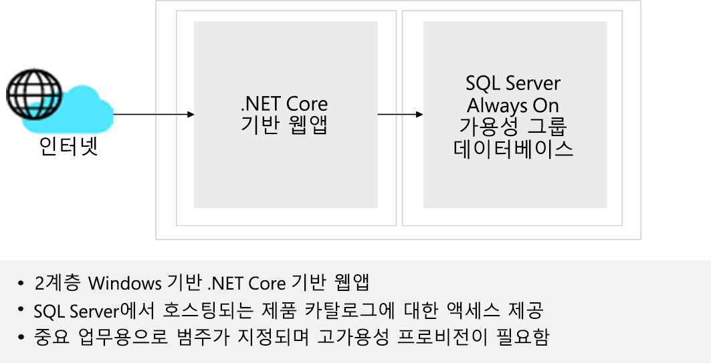

---
casestudy:
    title: '네트워크 솔루션 디자인 - 제품 카탈로그 엔터프라이즈 애플리케이션'
    module: '네트워크 인프라 솔루션(옵션 1)'
---
# 네트워크 인프라 솔루션 디자인  

소요 시간: 60분

## 요구 사항

Tailwind Traders 기업 IT 팀은 회사 워크로드 중 일부를 Azure로 마이그레이션하는 전략 정의를 준비하는 과정의 일환으로 필요한 네트워킹 구성 요소를 파악하고 이러한 구성 요소를 지원하는 데 필요한 네트워크 인프라를 디자인해야 합니다. Tailwind Traders는 전 세계에서 사업을 운영하고 있으므로 여러 Azure 지역을 사용하여 애플리케이션을 호스트할 예정입니다. 이러한 애플리케이션 중 대다수는 인프라와 데이터 서비스를 사용하는데, 해당 인프라와 데이터 서비스도 Azure에서 제공될 예정입니다. Tailwind Traders 사용자는 Azure로 마이그레이션하는 내부 애플리케이션에 계속 액세스할 수 있어야 합니다. 외부 사용자는 Azure로 마이그레이션하는 인터넷용 애플리케이션에 계속 액세스할 수 있어야 합니다. 

Tailwind Traders 기업 IT 팀은 초기 네트워킹 디자인 통합을 위해 두 가지 주요 애플리케이션을 선택했습니다. 이 두 애플리케이션은 Azure로 마이그레이션할 가장 일반적인 워크로드 범주에 해당됩니다.  

### 디자인 - 제품 카탈로그 엔터프라이즈 애플리케이션

- 인터넷용 Windows 기반 2계층 .NET Core 기반 웹앱. SQL Server Always On 가용성 그룹 데이터베이스에서 호스트되는 이 애플리케이션을 통해 제품 카탈로그에 액세스할 수 있습니다. 중요 업무용으로 분류되는 이 애플리케이션의 가용성 SLA는 99.99%이고 RPO는 10분, RTO는 2시간입니다. 

-	실무 책임자는 인터넷용 앱 액세스 시 최적의 사용자 환경 제공을 매우 중요하게 생각합니다. 그러므로 웹 페이지 로드 및 정적 콘텐츠 다운로드 시간을 최소화해야 합니다. 마찬가지로, 웹앱 구성 요소와 해당 종속성을 호스트하는 개별 서버에서 발생하는 장애가 웹앱 가용성에 주는 영향을 고객이 인지할 수 없을 정도로 최대한 낮춰야 합니다. 특정 지역에서 장애가 발생하면 기존 웹 세션이 중단될 수 있는데, 이러한 경우 재해 복구 사이트로의 장애 조치(failover)가 자동으로 진행되어야 합니다.

- Tailwind Traders의 기업 IT 팀은 Azure PaaS 서비스에서 제공하는 이점을 활용하기 위해 Azure SQL Database를 사용하여 제품 카탈로그 엔터프라이즈 애플리케이션의 데이터베이스를 구현하기로 결정했습니다. 

- Tailwind Traders 정보 보안 및 위험 팀의 요청에 따라, 동일 애플리케이션에 포함된 PaaS 서비스와 Azure VM 간의 모든 통신은 PaaS 서비스의 공용 엔드포인트가 아닌 Azure 백본을 통해 진행되어야 합니다. 

## 작업 - 제품 카탈로그 엔터프라이즈 애플리케이션

1. 제품 카탈로그용 2계층 네트워크 솔루션을 디자인하세요. 해당하는 경우에는 Azure Front Door, WAF, Azure Firewall, Azure Load Balancer를 솔루션 디자인에 포함해야 합니다. 네트워킹 구성 요소는 가상 네트워크로 그룹화해야 하며, 네트워크 보안 그룹을 고려해야 합니다. 디자인에 포함된 각 구성 요소를 선택한 이유를 설명할 수 있도록 준비하세요. 

안정적이며 효율적인 고품질 클라우드 아키텍처를 생성하려면 Well-Architected Framework 원칙을 어떻게 통합해야 하나요?

