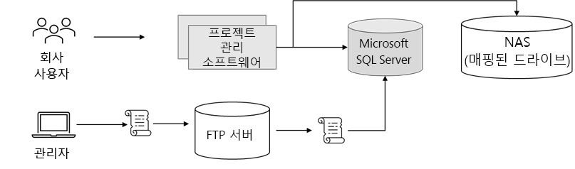
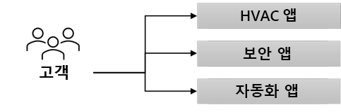

---
casestudy:
    title: '사례 연구(선택 사항): Fabrikam Residences'
    module: '사례 연구(선택 사항): Fabrikam Residences'
---
# 사례 연구(선택 사항): Fabrikam Residences

소요 시간: 90분

## 요구 사항

**이 사례 연구를 진행하려면 다음 모듈과 사례 연구를 완료해야 합니다.  컴퓨팅, 관계형 데이터, 비관계형 데이터, 인증, 애플리케이션 아키텍처**

여러분은 Fabrikam Residences에서 새로운 직책을 맡게 되었습니다. Fabrikam Residences은 높은 사업 실적을 기록하고 있으며, 사업 분야도 빠르게 확대되고 있습니다. 주택 신축 및 개조 전문 건축 수급업체인 Fabrikam Residences는 고품질 건물을 짓고 경쟁업체보다 우수한 최신 통합형 홈 관리 기술을 제공하여 높은 실적을 달성할 수 있었습니다.  

이러한 기술은 현재 다른 하도급업자가 제공 및 관리하고 있습니다. 그런데 Fabrikam Residences 경영진은 고객 패턴과 요구에 더욱 적합한 고품질 지원과 데이터를 제공하기 위해 이처럼 업그레이드된 기술 옵션을 이제는 사내에서 직접 제공하고자 합니다. 
 
일단은 HVAC(냉/난방) 제어 및 모니터링, 보안 시스템 모니터링 및 알림, 홈 오토메이션 기술부터 제공할 예정입니다. 그러려면 신규 웹 사이트, 데이터 스토리지 솔루션 및 데이터 수집 솔루션이 필요합니다.

Fabrikam Residences는 지난 2년 동안 사업 규모를 대폭 확대해 왔습니다. 그리고 향후 12~18개월 이내에 사업 규모가 현재의 2배 규모로 증가할 것으로 예상하고 있습니다. 이처럼 국내 시장에서 사업 규모가 급격히 확대되고는 있지만 현재로서는 외부 시장으로 진출할 계획이 없습니다.

## 현재 상황

Fabrikam 본사에서는 소규모 데이터 센터 한 곳을 운영하고 있습니다. 이 데이터 센터에서는 회사의 **PM(프로젝트 관리) 소프트웨어**를 호스트합니다.

- PM 소프트웨어는 타사 Windows 애플리케이션을 사용합니다. 이 애플리케이션은 Microsoft SQL Server 백 엔드 하나가 포함된 2노드 NLB(네트워크 부하 분산) 클러스터를 사용합니다.  

- 이미지와 문서는 서버의 매핑된 드라이브에 저장되며, 이 드라이버는 전용 NAS 어플라이언스에 있습니다.

- 회사 사용자(사무 직원)는 웹 프런트 엔드를 사용해 소모품 배달 일정, 변경 주문 등의 데이터를 입력합니다.

-	현장 관리자는 오프라인 Windows 노트북과 태블릿을 사용해 건축 진행 상황과 기타 세부 정보를 지속적으로 기록합니다.  신규 작업 주문 등의 이러한 변경 내용은 로컬 변경 파일에 저장됩니다.  관리자는 매일 업무 종료 시 사무실에 복귀하여 무선 네트워크에 연결한 후 간단한 스크립트를 실행하여 FTP 서버에 변경 파일을 업로드합니다.  그리고 매일 야간에 실행되도록 예약된 두 번째 스크립트는 모든 변경 파일을 처리한 후 해당 내용을 프로젝트 관리 데이터베이스(Microsoft SQL Server)에 입력합니다.

현재는 타사에서 제공 및 호스트하는 **Home Technology 소프트웨어**를 사용할 때는 고객이 웹 사이트를 3개 이상 방문해야 합니다.  이 소프트웨어를 사내에서 개발한 통합 솔루션으로 바꾸자는 제안이 나왔습니다.

## 요구 사항 

**프로젝트 관리 소프트웨어**

- 최대한 많은 시스템을 퍼블릭 클라우드 공급자로 마이그레이션해야 합니다.

- 보안 문제가 발생했으므로 기존 스크립트 대신 FTP보다 더 안전한 시스템을 활용해야 합니다. 그리고 변경 파일을 업로드되는 즉시 처리해야 합니다.

- 프로젝트 관리 데이터베이스의 복원력을 높여야 합니다. Fabrikam Residences는 솔루션을 성능을 중요하게 고려하지는 않지만, 하드웨어 하나에서 발생하는 장애로 인해 데이터베이스에 액세스하지 못하는 상황은 방지하고자 합니다.

**신규 Home Technology 솔루션**

- 홈 모니터링 센서에서 데이터를 지속적으로 수집하는 새 솔루션을 추가합니다.
  - 추세 분석 및 보고용으로 센서 판독값 중 일부를 데이터베이스로 작성합니다.
  - 주택 소유주의 요구에 따라 구성 가능한 실시간 알림을 제공합니다.
  
- 주택 소유주의 선호 사항과 설정을 반영하는 관계형 데이터베이스 솔루션을 디자인합니다.
  - 시스템은 확장이 가능해야 합니다.
  - 시스템에서는 중복성이 보장되어야 합니다.
  
- 신규 통합 웹 사이트는 사내에서 개발하여 Linux에서 호스트할 예정입니다.  이 웹 사이트는 온도 또는 알림 임계값과 같은 항목의 모니터를 확인하고 기본 설정을 변경하는 데 사용됩니다. 상황에 따라 부하가 크게 달라질 수 있으므로 시스템을 빠르게 확장할 수 있어야 합니다.

-	사용자가 다른 사용자 계정과 암호를 만들지 않고도 시스템에 로그인하는 방법을 제공해야 합니다.

- 보안 컨트롤을 구현하고, 회사의 업계 표준 모범 사례 준수 수준을 대략적으로 파악할 수 있는 주간 보고서를 제공해야 합니다.

## 작업 

1. 프로젝트 관리 소프트웨어용 솔루션을 디자인하세요. 디자인에 포함된 각 구성 요소를 선택한 이유, 그리고 해당 디자인이 솔루션 요구 사항을 충족하는 방식을 설명할 수 있도록 준비하세요.

2. 신규 Home Technology 솔루션용 아키텍처를 디자인하세요. 디자인에 포함된 각 구성 요소를 선택한 이유, 그리고 해당 디자인이 솔루션 요구 사항을 충족하는 방식을 설명할 수 있도록 준비하세요.

안정적이며 효율적인 고품질 클라우드 아키텍처를 생성하려면 Well-Architected Framework 원칙을 어떻게 통합해야 하나요?
